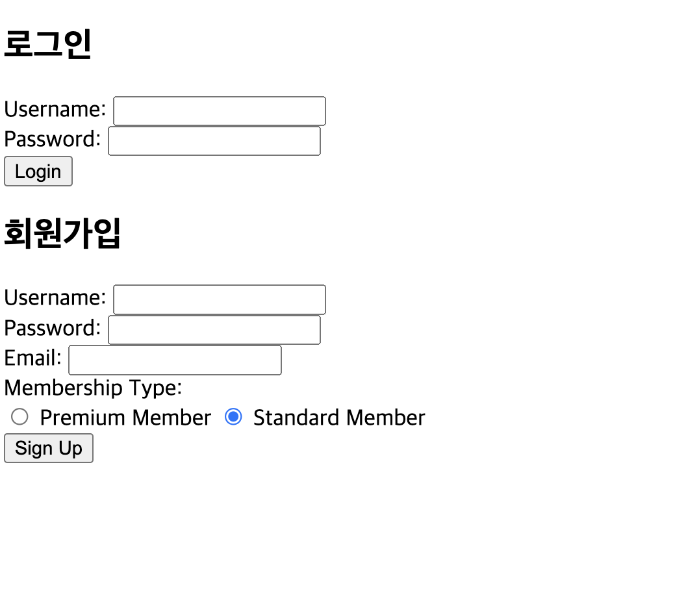
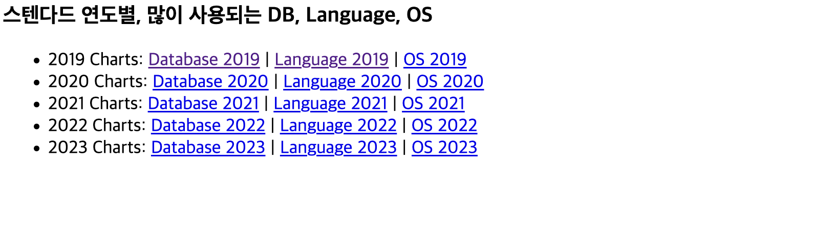
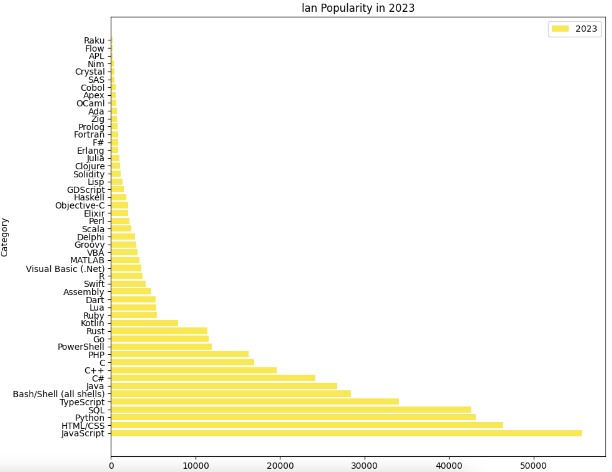
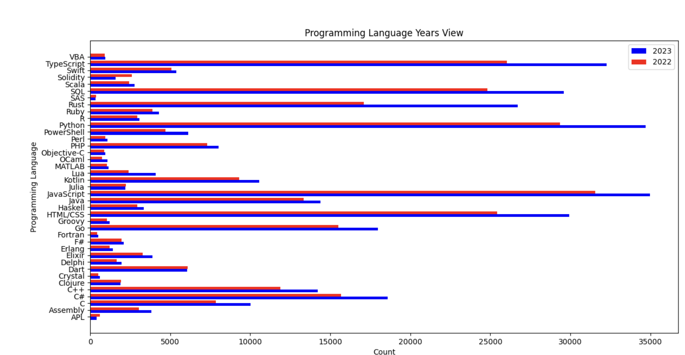

# 개요
> Spring을 이용하여 회원가입창을 구현하였습니다. 회원가입 시 스텐다드 or 프리미엄 선택 후 가입하게 됩니다.

> 회원가입 정보를 MySql로 보냅니다. 스탠다드, 프리미엄 회원 구분하였습니다.

> StackOverFlow 유저 대상으로 설문을하여 2019년 ~ 2023년까지 연도별로 가장 많이 사용되는 프로그램언어, OS, DB 파일을 시각화하여 차트를 구현하였습니다.

### 회원가입, 로그인화면

### 스텐다드 회원 선택

### 스텐다드 차트 노출

### 프르미엄 차트 노출

## 빌드 환경
* Visual Studio 2022 이상
* Spring, MySql 실행할 수 있는 환경

## 테스트환경
* Mac / Window 10 이상
* Every Tool
